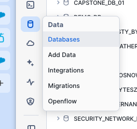
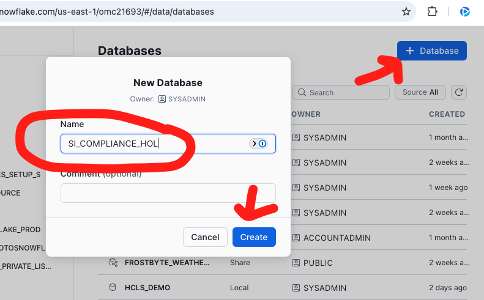
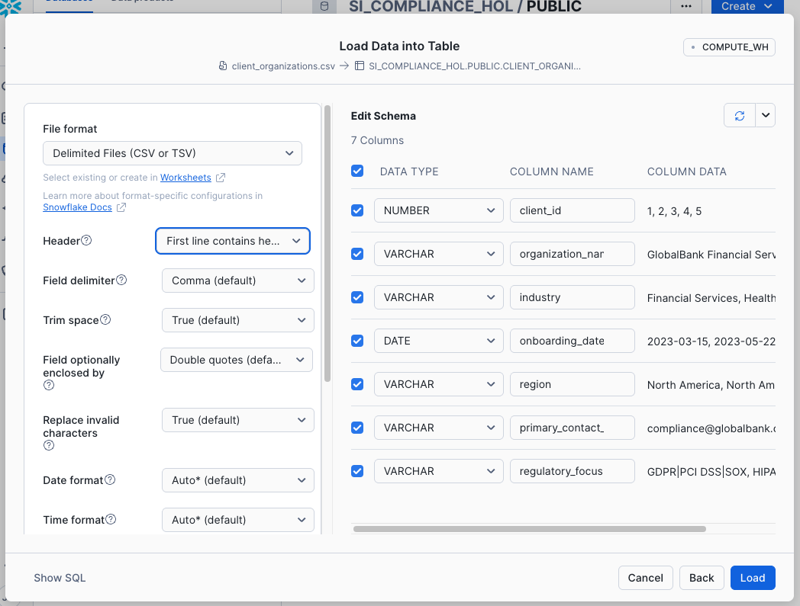
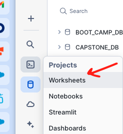

# Snowflake Intelligence HOL

## Step 1: Getting Data Into Snowflake

Global Risk Company's AI-powered regulatory compliance platform processes three distinct types of data to enable intelligent cross-referencing between structured internal compliance data and unstructured external regulatory information.

**Structured Data**: Traditional relational data stored in CSV format with defined schemas
- `client_organizations.csv` - Client companies using the Global Risk Company platform with their regulatory focus areas
- `audit_events.csv` - Scheduled and completed compliance audits across clients

**Semi-Structured Data**: JSON formatted security incident reports that provide context about security events
- `security_incidents.json` - Security incident records with nested objects containing asset information, mitigation steps, and risk assessments


### Step 1a: Load Structured Data

For this step, we will focus on loading the structured data that forms the foundation of Global Risk Company's compliance monitoring. We'll start with two CSV files containing relational data with well-defined schemas.

Log into your Snowflake Demo Account and make sure that you are logged in with the **SYSADMIN** role. 


Let's create a database we will call it `SI_COMPLIANCE_HOL`:





#### Loading Client Organizations Table

1. **Navigate to Tables**: Go into the `SI_COMPLIANCE_HOL` database, then the Public schema, and click on tables. Click the "Create" button on the top right to create a table from a file.

   

2. **Upload File**: Select the `client_organizations.csv` file from the data folder.

3. **Name the Table**: Name the table `CLIENT_ORGANIZATIONS`:

   

4. **Configure File Format**: Open the View Options section in the file format area and make sure that the header is the first line of the document:

   

   

5. **Create the Table**: Click "Create Table" to complete the process.

#### Loading Audit Events Table

6. **Repeat the Process**: Follow the same steps (1-5) above for the `audit_events.csv` file, naming the table `AUDIT_EVENTS`.

#### Validate Your Data

Once both tables are created, open a new worksheet 

   

   

   

and run these validation queries:

**Validate Client Organizations:**
```sql
-- Check table structure and sample data
SELECT * FROM SI_COMPLIANCE_HOL.PUBLIC.CLIENT_ORGANIZATIONS LIMIT 5;

-- Count total organizations by region
SELECT REGION, COUNT(*) as CLIENT_COUNT 
FROM SI_COMPLIANCE_HOL.PUBLIC.CLIENT_ORGANIZATIONS 
GROUP BY REGION 
ORDER BY CLIENT_COUNT DESC;
```

**Validate Audit Events:**
```sql
-- Check table structure and sample data
SELECT * FROM SI_COMPLIANCE_HOL.PUBLIC.AUDIT_EVENTS LIMIT 5;

-- Count audits by status
SELECT STATUS, COUNT(*) as AUDIT_COUNT 
FROM SI_COMPLIANCE_HOL.PUBLIC.AUDIT_EVENTS 
GROUP BY STATUS 
ORDER BY AUDIT_COUNT DESC;
```

**Verify Relationship Between Tables:**
```sql
-- Join tables to see client organizations with their scheduled audits
SELECT 
    co.ORGANIZATION_NAME,
    co.INDUSTRY,
    ae.AUDIT_NAME,
    ae.AUDIT_TYPE,
    ae.SCHEDULED_DATE
FROM SI_COMPLIANCE_HOL.PUBLIC.CLIENT_ORGANIZATIONS co
JOIN SI_COMPLIANCE_HOL.PUBLIC.AUDIT_EVENTS ae 
    ON co.CLIENT_ID = ae.CLIENT_ID
WHERE ae.STATUS = 'Scheduled'
ORDER BY ae.SCHEDULED_DATE
LIMIT 10;
```

You should see data returned from all these queries, confirming your structured data is properly loaded.

### Step 1b: Load Semi-Structured Data (JSON)

Now we'll load the semi-structured data which contains security incident reports in JSON format. This demonstrates how Snowflake handles complex, nested data structures that vary in attributes.

#### Loading Security Incidents Table

You will follow exactly the same steps as we did to load the structured data.

1. **Navigate to Tables**: Go back to the `SI_COMPLIANCE_HOL` database, Public schema, and click on tables. Click the "Create" button to create a table from a file.

2. **Upload File**: Select the `security_incidents.json` file from the data folder.

3. **Name the Table**: Name the table `SECURITY_INCIDENTS`.

4. **Configure File Format**: For JSON files, Snowflake will automatically detect the structure. You may see options for JSON parsing - accept the defaults which will create a VARIANT column to store the JSON data.

  

5. **Create the Table**: Click "Create Table" to complete the process.

#### Validate and Parse JSON Data

Once the table is created, go back to the same worksheet where we ran the previous queries and run these queries to understand how to work with JSON data in Snowflake:

**Basic JSON Structure:**
```sql
-- View raw JSON structure
SELECT * FROM SI_COMPLIANCE_HOL.PUBLIC.SECURITY_INCIDENTS LIMIT 3;
```

**Parse Top-Level JSON Fields:**
```sql
-- Extract key fields from JSON into columns
SELECT 
    $1:incidentId::STRING as INCIDENT_ID,
    $1:incidentType::STRING as INCIDENT_TYPE,
    $1:status::STRING as STATUS,
    $1:clientId::NUMBER as CLIENT_ID,
    $1:detectionTime::TIMESTAMP as DETECTION_TIME,
    $1:resolutionTime::TIMESTAMP as RESOLUTION_TIME
FROM SI_COMPLIANCE_HOL.PUBLIC.SECURITY_INCIDENTS
LIMIT 10;
```

**Access Nested Objects:**
```sql
-- Extract risk assessment details from nested JSON object
SELECT 
    $1:incidentId::STRING as INCIDENT_ID,
    $1:incidentType::STRING as INCIDENT_TYPE,
    $1:riskAssessment.impact::STRING as RISK_IMPACT,
    $1:riskAssessment.likelihood::STRING as RISK_LIKELIHOOD,
    $1:riskAssessment.score::NUMBER as RISK_SCORE
FROM SI_COMPLIANCE_HOL.PUBLIC.SECURITY_INCIDENTS
ORDER BY $1:riskAssessment.score::NUMBER DESC
LIMIT 10;
```

**Flatten JSON Arrays:**
```sql
-- Flatten the affectedAssets array to see individual assets
SELECT 
    si.$1:incidentId::STRING as INCIDENT_ID,
    si.$1:incidentType::STRING as INCIDENT_TYPE,
    asset.value:assetId::STRING as ASSET_ID,
    asset.value:assetType::STRING as ASSET_TYPE,
    asset.value:assetOwner::STRING as ASSET_OWNER
FROM SI_COMPLIANCE_HOL.PUBLIC.SECURITY_INCIDENTS si,
LATERAL FLATTEN(input => $1:affectedAssets) as asset
LIMIT 15;
```

**Join JSON Data with Structured Data:**
```sql
-- Connect incidents to client organizations
SELECT 
    co.ORGANIZATION_NAME,
    co.INDUSTRY,
    si.$1:incidentId::STRING as INCIDENT_ID,
    si.$1:incidentType::STRING as INCIDENT_TYPE,
    si.$1:status::STRING as STATUS,
    si.$1:riskAssessment.score::NUMBER as RISK_SCORE
FROM SI_COMPLIANCE_HOL.PUBLIC.SECURITY_INCIDENTS si
JOIN SI_COMPLIANCE_HOL.PUBLIC.CLIENT_ORGANIZATIONS co 
    ON si.$1:clientId::NUMBER = co.CLIENT_ID
WHERE si.$1:status::STRING = 'In Progress'
ORDER BY si.$1:riskAssessment.score::NUMBER DESC;
```

**Analyze Compliance Impact Arrays:**
```sql
-- Flatten compliance impact arrays to see regulatory implications
SELECT 
    si.$1:incidentId::STRING as INCIDENT_ID,
    si.$1:incidentType::STRING as INCIDENT_TYPE,
    compliance.value::STRING as COMPLIANCE_STANDARD
FROM SI_COMPLIANCE_HOL.PUBLIC.SECURITY_INCIDENTS,
LATERAL FLATTEN(input => $1:complianceImpact) as compliance
WHERE si.$1:status::STRING != 'Closed'
ORDER BY si.$1:incidentId::STRING;
```

These queries demonstrate Snowflake's powerful JSON parsing capabilities, allowing you to treat semi-structured data as if it were relational while preserving the flexibility of the original JSON structure.

-----

## Step 2: External Data Integration via Snowflake Data Sharing

Now that we have our foundation data loaded (structured and semi-structured), we'll demonstrate how Global Risk Company accesses external regulatory intelligence through Snowflake Data Sharing. This represents the third data type in our progressive strategy: unstructured external data from regulatory bodies and compliance frameworks.

### Understanding Data Sharing for Compliance Intelligence

Snowflake Data Sharing enables Global Risk Company to access real-time regulatory updates, legal interpretations, and compliance frameworks from external providers without data movement. This external intelligence is then cross-referenced with internal compliance data using AI.

**Key Benefits for Regulatory Compliance:**
- Real-time access to regulatory updates
- No data duplication or ETL processes
- Secure access to sensitive regulatory information
- Integration with existing compliance workflows

### Accessing a Private Data Share

In this step, we'll simulate accessing external regulatory data through a private data share. In a real-world scenario, this could be regulatory documents from government agencies, legal interpretations from law firms, or compliance frameworks from industry bodies.

#### Step 2a: List Available Data Shares

First, let's see what data shares are available to your account:

```sql
-- List all available data shares (both inbound and outbound)
SHOW SHARES;
```

#### Step 2b: View Share Details

To examine the contents of a specific share before consuming it:

```sql
-- This shows the databases and schemas available in the share
DESC SHARE COMPLIANCE_DOCUMENTS_SHARE;
```

#### Step 2c: Create Database from Share

Once you've identified the share you want to consume, create a database from it:

```sql
-- Create a database from a private data share
-- Replace with actual share provider account and share name
CREATE DATABASE EXTERNAL_REGULATORY_DATA 
FROM SHARE SFSENORTHAMERICA.JHECKMAN_AWS1.COMPLIANCE_DOCUMENTS_SHARE;

-- Grant access to the shared database
GRANT IMPORTED PRIVILEGES ON DATABASE EXTERNAL_REGULATORY_DATA TO ROLE SYSADMIN;
GRANT IMPORTED PRIVILEGES ON DATABASE EXTERNAL_REGULATORY_DATA TO ROLE PUBLIC;
```

#### Step 2d: Explore Shared Data

Now explore the structure and content of the shared data:

```sql
-- List schemas in the shared database
SHOW SCHEMAS IN DATABASE EXTERNAL_REGULATORY_DATA;

-- List tables in a specific schema
SHOW TABLES IN DATABASE EXTERNAL_REGULATORY_DATA.PUBLIC;

-- Examine table structure
DESC TABLE EXTERNAL_REGULATORY_DATA.PUBLIC.REGULATORY_UPDATES;

-- Sample the data to understand its structure
SELECT * FROM EXTERNAL_REGULATORY_DATA.PUBLIC.REGULATORY_UPDATES LIMIT 5;
```

#### Step 2e: AI-Powered Analysis of Shared Regulatory Data

Here are two queries that demonstrate Snowflake's AI SQL capabilities for intelligent regulatory analysis:

```sql
-- Query 1: AI-Powered Compliance Question Answering
-- Use CORTEX.EXTRACT_ANSWER to automatically extract specific compliance requirements from regulatory text
SELECT 
    ru.REGULATION_TYPE,
    ru.UPDATE_TITLE,
    ru.UPDATE_DATE,
    CORTEX.EXTRACT_ANSWER(
        ru.REGULATORY_TEXT, 
        'What are the specific data retention requirements mentioned in this regulation?'
    ) as DATA_RETENTION_REQUIREMENTS,
    CORTEX.EXTRACT_ANSWER(
        ru.REGULATORY_TEXT, 
        'What are the penalties for non-compliance?'
    ) as COMPLIANCE_PENALTIES
FROM EXTERNAL_REGULATORY_DATA.PUBLIC.REGULATORY_UPDATES ru
WHERE ru.REGULATION_TYPE IN ('GDPR', 'CCPA', 'HIPAA')
    AND ru.UPDATE_DATE >= DATEADD(month, -6, CURRENT_DATE())
ORDER BY ru.UPDATE_DATE DESC;

-- Query 2: AI-Powered Regulatory Impact Analysis
-- Use CORTEX.SUMMARIZE and CORTEX.SENTIMENT to analyze regulatory changes and their business impact
SELECT 
    ru.REGULATION_TYPE,
    ru.UPDATE_TITLE,
    ru.IMPACT_ASSESSMENT,
    CORTEX.SUMMARIZE(ru.REGULATORY_TEXT) as AI_SUMMARY,
    CORTEX.SENTIMENT(ru.REGULATORY_TEXT) as REGULATORY_SENTIMENT,
    CASE 
        WHEN CORTEX.SENTIMENT(ru.REGULATORY_TEXT) < -0.5 THEN 'Restrictive/Challenging'
        WHEN CORTEX.SENTIMENT(ru.REGULATORY_TEXT) > 0.5 THEN 'Supportive/Enabling'
        ELSE 'Neutral'
    END as BUSINESS_IMPACT_CLASSIFICATION,
    co.ORGANIZATION_NAME,
    co.INDUSTRY
FROM EXTERNAL_REGULATORY_DATA.PUBLIC.REGULATORY_UPDATES ru
JOIN SI_COMPLIANCE_HOL.PUBLIC.CLIENT_ORGANIZATIONS co 
    ON ru.REGULATION_TYPE = co.PRIMARY_REGULATION
WHERE ru.UPDATE_DATE >= DATEADD(month, -3, CURRENT_DATE())
    AND ru.IMPACT_ASSESSMENT IN ('High', 'Critical')
ORDER BY CORTEX.SENTIMENT(ru.REGULATORY_TEXT), ru.UPDATE_DATE DESC;
```

## Step 3: Snowflake Intelligence Setup

### A few things to note:

  * If you go into Snowflake Intelligence at this point, it will say "No agents created."
  * At this time, Snowflake Intelligence (SI) will utilize your default role. You need to make sure this is set to the role we will create in the lab (directions below).
  * Snowflake Intelligence will also utilize your default warehouse; you must set this up for SI to work.

Users in Snowflake Intelligence will map to Snowflake users. Over time, we will move the UI out of Snowflake Snowsight and into a standalone experience (ai.Snowflake.com), but even there, Snowflake roles are planned to be leveraged for configuration. Users of Snowflake Intelligence need a few layers of permissions:

  * They need permission to the underlying Cortex Search Service and the ability to call Cortex Analyst.
  * They need permission for any underlying data surfaced by an agent.

-----

### Important notes:

  * Users for Snowflake Intelligence need to have a default role and a default warehouse.
  * The database needs to be named `Snowflake_intelligence`.

### Metadata Objects

Please create a new worksheet and run this script to create the database and schema needed to organize agents that surface in Snowflake Intelligence.

```sql
use role sysadmin;
create database snowflake_intelligence;
create schema snowflake_intelligence.agents;

-- make sure anyone in the account can SEE agents
grant usage on schema snowflake_intelligence.agents to role public;

-- optional - you can grant other roles the ability to create agents
-- grant create agent on schema snowflake_intelligence.agents to role <some_role>;
```

-----


-----

## Step 4: Create a Simple Agent

What is an agent? Agentic AI is the buzzword of 2025, but with Snowflake agents, these are tangible things we're creating that will include one or more Cortex building blocks, like an analyst semantic model or search service.

Go to Snowflake, and the Agents section should now work with the config tables we created above. The page will keep attempting to redraw at this point, but that is expected for now. Go ahead and click on Create Agent.


Let's create a very simple agent. Let's name it **Global Risk Agent**. Let's give it a Display name of **Global Risk Agent** as well.


Refresh the screen, and we will see the new agent created:


-----

## Step 5: Go to Snowflake Intelligence

To easily navigate while using the Snowflake Intelligence application, open a new browser tab specifically for Snowsight. This will allow you to switch between the standard Snowsight interface and the Snowflake Intelligence application, which you can access via the Snowflake Intelligence link. After clicking the link, the navigation will change to focus on Snowflake Intelligence.


Now we can see our agent that we created in the dropdown and be able to interact with Snowflake intelligence easily:


I can also upload files as needed to have Global Risk Agent look at the file and complete my analysis.

Go ahead and query Snowflake Intelligence. Let's ask this: What can you tell me about the company Snowflake?


We have currently developed a basic agent lacking access to data within your Snowflake account. It solely interacts with Claude. To enhance its intelligence, we need to integrate a semantic model and connect it to the agent, thereby providing improved context.

-----

## Step 6: Create a Semantic Model

Let's now build a more intelligent agent that analyzes the data within Snowflake by utilizing our semantic layer.

Lets create a semantic view using cortex analyst: 
NOTE: Figure out permissions here!


Go ahead and select create new view:


We can choose the SI\_COMPLIANCE\_HOL database and PUBLIC schema we created earlier. Then we can select Semantic Views and enter the following name and description:

  * **Name:** `compliance_monitoring`
  * **Description:** `This has information on regulatory compliance monitoring, including client organizations, audit events, and compliance documents`

Let's select our tables from the SI\_COMPLIANCE\_HOL data that we imported at the beginning of the lab:


Then we can select the columns to choose. Let's just select all columns by choosing the top checkbox:


### View the Results

When we click 'Create and Save' it will generate a starter semantic model for us:


We can see that it has already created a description as well as some other details, like synonyms. Let's go ahead and add 'assessment' and 'review' to the list of synonyms for AUDIT\_NAME in the AUDIT_EVENTS table:


### Move Columns

The model incorrectly identified AUDIT\_ID as a fact due to its numerical data type, but it is actually a dimensional column. This can be easily corrected by moving it to the dimensions section in the edit menu. It is crucial to review and adjust the model after Snowflake's initial column categorization.


We will need to do this for the following incorrectly identified columns:

1.  AUDIT_EVENTS
      * AUDIT\_ID - move to dimension
      * CLIENT\_ID - move to dimension
2.  CLIENT_ORGANIZATIONS
      * CLIENT\_ID - move to dimension
3.  COMPLIANCE_DOCUMENTS
      * Any ID columns - move to dimension as needed

We also need to assign unique values option to primary keys. We will do this for the following tables:

1.  Audit Events
      * Audit\_ID
2.  Client Organizations
      * Client\_ID
3.  Compliance Documents
      * Document identifier as appropriate

This is done by editing each dimension and then checking the box for unique identifier:


Do this for all the listed tables above. Then you will need to save the semantic model and refresh the page.


### Test the Model

I can test this model right now by going to the side window and putting in the following prompt: `What are the different client organizations in Europe`


Then it will go against my model and then write SQL, and then execute that SQL against my model.

### Define Table Relationships

We then need to define our relationships with the other tables. By default, no relationships are created, but they are needed for more complex queries that span multiple tables. When selecting the columns if you do not see your columns you might have missed the step to make ID columns unique on the table please see above. You might also just need to do a full refresh on the page.

Our first relationship we will define is AUDIT\_EVENTS to CLIENT_ORGANIZATIONS. For every CLIENT, there are many audit events, and the joining column is CLIENT\_ID. Let's define a relationship that represents that:

  * **Relationship Name:** `AuditEvents_to_ClientOrganizations`
  * **Left Table:** `Audit_Events`
  * **Right Table:** `Client_Organizations`
  * **Relationship Columns:** `CLIENT_ID` and `CLIENT_ID`


Let's add a second relationship for compliance documents if there are linking fields:

  * **Relationship Name:** `ComplianceDocuments_to_AuditEvents`
  * **Left Table:** `Compliance_Documents`
  * **Right Table:** `Audit_Events`
  * **Relationship Columns:** Based on available linking columns


Now we have relationships set up in our semantic model. Let's go ahead and test them using the prompt on the right side. We can ask this: `How many audits are scheduled for GlobalBank Financial Services?`


We can see that it was able to utilize our join and see how many tickets were sold for that event by joining the two tables together we defined in our relationship.

We can also ask it to `Count the total client organizations by region that have GDPR audits scheduled`, and this should span all of our tables in our semantic model and give us values:


Excellent\! This functionality is operating as anticipated.

### Verify the Queries

Since these queries returned the correct values, we can add them as verified queries, which will fuel our model's improvement.


These will now show up under verified queries in our model definition:


### Save the Model

When you are done, make sure you save the model:


-----

## Step 7: Create an Agent to Use the Semantic Model

Let's go back to the agents now and create a new Agent.


We will use the following information:

  * **Name:** `Compliance_Monitoring_Agent`
  * **Description:** `An agent that can return information about regulatory compliance monitoring, audit events, and client organizations`

After those are filled in, go ahead and click '+ Semantic Model', and attach the semantic model we created earlier.


Then go ahead and edit the agent by click on it.


Then go to edit:


Then choose tools and add the semantic model you created from earlier:

  * Choose to add a semantic view
  * Choose the database and schema where we created it (SI\_COMPLIANCE\_HOL.PUBLIC)
  * Choose the Semantic View we created: COMPLIANCE\_MONITORING
  * Choose the warehouse: Snowflake\_Intelligence\_WH
  * Choose the Query Timeout: 600
  * Write a description: This is our compliance monitoring data that we have stored in snowflake in tables and structured data

Click Add the Semantic model


After adding be sure to click save in the agent editor.


-----

## Step 8: Test with Smart Agent

Let's go back to Snowflake Intelligence to see our new agent, which leverages our semantic model. Either click Snowflake Intelligence or go to your Snowflake Intelligence tab and refresh the page.

We can now see the Compliance Monitoring Agent.


Let's ask it a question: `Show me the top 5 client organizations by number of scheduled audits.`


Fantastic, it gave us an answer with a chart of the top 5 client organizations\! I can open the SQL section and see the join in the SQL.


We can ask another question: `What types of audits are scheduled for GlobalBank Financial Services?`


A third question I could ask is: `Which clients have multiple compliance assessments scheduled?` This would utilize a synonym we created (assessment) as well as utilize the relationship we created between audit events and client organizations:


These answers appear to be correct. If they were incorrect, the first step would be to review the semantic model. This review would focus on verifying the accuracy of the defined relationships and identifying any potential synonyms that could enhance the model's intelligence and robustness.

-----

## Step 9: Create Search Service

We have document data that has been parsed and loaded into a table named Compliance_Documents from a compliance_documents.csv file. To enable searching of this text data, we will create a search service. This can be done by navigating to Al & ML, then Cortex Search, and following the wizard.


We can create it in our SNOWFLAKE\_INTELLIGENCE.CONFIG database and schema, and call it `Compliance_Document_Search`.


Going to the next screen, it asks for the table that it wants to index. We will select a table that we uploaded earlier. This is in the SI\_COMPLIANCE\_HOL.PUBLIC and our table is called COMPLIANCE_DOCUMENTS.


The next screen asks us to choose which column we want to be able to search. In our case, the column name is TEXT. Go ahead and select that column from the list.


Next, it is asking what attributes we want to bring in. We will choose both DOCUMENT\_TITLE and URL:


We will leave all columns on the next page selected:


As this is a demonstration with unchanging data, the chosen lag time is inconsequential. Therefore, a 1-day lag can be applied.


Now our Search Service is created:


> **NOTE:** If your search service hangs in 'Initialize' for more than a few minutes, it might have failed. This is going to be fixed in the UI in the future. However, right now you can run: `DESC CORTEX SEARCH SERVICE COMPLIANCE_DOCUMENT_SEARCH;` and look at the indexing\_error column, chances are it is a missing permission on an object such as a database, schema, table, or warehouse.

-----

## Step 10: Add to Agent

We will reuse the previously created "Compliance Monitoring Agent" and integrate the Search Service we built into it. To do this, select the existing agent and then go to edit and proceed to add the Search Service.

Then choose Tools and add the Compliance Document Search Cortex search agent you created. Choose the URL and Document Title as shown below:


We will then add the search service by selecting where we created it, which was in SNOWFLAKE\_INTELLIGENCE.CONFIG we will call it Compliance Documents, and make sure we define the URL column in our search service, which is called URL:

The service needs to be active before it can function, which will take a few minutes. Completion is indicated when the Serving State shows as ACTIVE.

> **NOTE:** If your search service hangs in 'Initialize' for more than a few minutes, it might have failed. This is going to be fixed in the UI in the future. However, right now you can run: `DESC CORTEX SEARCH SERVICE COMPLIANCE_DOCUMENT_SEARCH;` and look at the indexing\_error column, chances are it is a missing permission on an object such as a database, schema, table, or warehouse.


Make sure to save the agent after updating it with the new cortex search service:


-----

## Step 11: Test with Updated Agent

Let's go back to Snowflake Intelligence and make sure our new search service is available to query.


Now that we see our Snowflake Data there, we know it will utilize our search service we created. Let's ask it a question: `What are the key requirements for GDPR Article 17 Right to Erasure?`


Notice that no SQL is generated or written, as it is using our search service. It gives us the answer and the source of the document from which this information came.

-----

## Step 12: Review

This lab explored Snowflake Intelligence and its applications. Snowflake Intelligence enables analysts to efficiently query Snowflake data by leveraging a semantic model or the Cortex search service for data indexing.

Our steps were:

1.  Introduced Global Risk Company's data ingestion strategy covering structured, semi-structured, and unstructured data types
2.  Loaded compliance data including CSV files and JSON security incidents
3.  Demonstrated external data integration via Snowflake Data Sharing for accessing regulatory intelligence
4.  Setup metadata for Snowflake Intelligence (this part will go away in the future)
5.  Created a simple agent that just used Claude with no Snowflake data
6.  Created a Semantic Model for compliance monitoring
7.  Created a new agent to utilize the semantic model and Snowflake Data
8.  Created a cortex search service for document search
9.  Updated our agent to utilize that search service
10. Tested prompts in Snowflake Intelligence that utilized our semantic model and/or our search service to get data from our Snowflake instance

Customers can now easily build a chatbot-like interface for analysts and search their Snowflake assets using simple wizards, requiring minimal coding. This eliminates the need for complex custom Python scripts (though that remains an option), enabling faster value realization with GenAI within Snowflake.

-----

## Step 13: Validate Using DORA

**Please only complete this if you are a snowflake employee and in the SE organization**

Congrats\! You have completed the lab. Please run the following commands in Snowsight to confirm your completion.

  - [Greeter Script for DORA](https://www.google.com/search?q=/config/SE_GREETER.sql)
  - [Grading Script for DORA](https://www.google.com/search?q=/config/DoraGrading.sql)

-----

## Step 14: Reset your default warehouse and Default Role

We recommend resetting your default role and warehouse to `ACCOUNTADMIN`. While not strictly necessary, this can help prevent issues in other labs.
