# Step 1: Getting Data Into Snowflake

[← Back to Index](../README.md) | [Next: Step 2 →](step-02.md)

Global Risk Company's AI-powered regulatory compliance platform processes three distinct types of data to enable intelligent cross-referencing between structured internal compliance data and unstructured external regulatory information.

**Structured Data**: Traditional relational data stored in CSV format with defined schemas
- `client_organizations.csv` - Client companies using the Global Risk Company platform with their regulatory focus areas
- `audit_events.csv` - Scheduled and completed compliance audits across clients

**Semi-Structured Data**: JSON formatted security incident reports that provide context about security events
- `security_incidents.json` - Security incident records with nested objects containing asset information, mitigation steps, and risk assessments

## Step 1a: Load Structured Data

For this step, we will focus on loading the structured data that forms the foundation of Global Risk Company's compliance monitoring. We'll start with two CSV files containing relational data with well-defined schemas.

Log into your Snowflake Demo Account and make sure that you are logged in with the **SYSADMIN** role. 

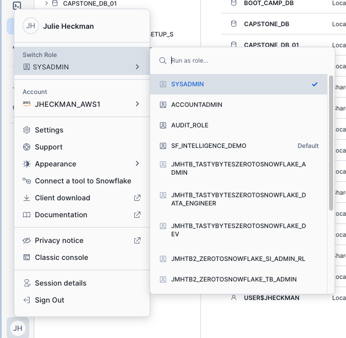

Let's create a database we will call it `SI_COMPLIANCE_HOL`:

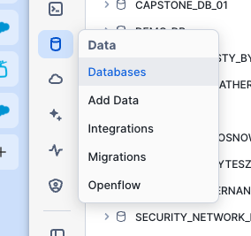

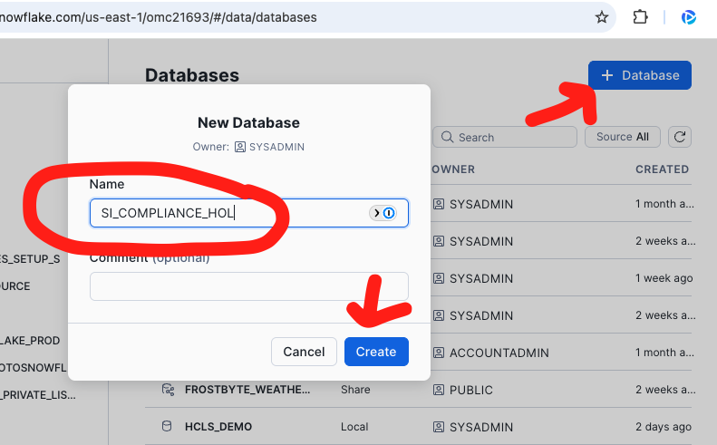

### Loading Client Organizations Table

1. **Navigate to Tables**: Go into the `SI_COMPLIANCE_HOL` database, then the Public schema, and click on tables. Click the "Create" button on the top right to create a table from a file.

   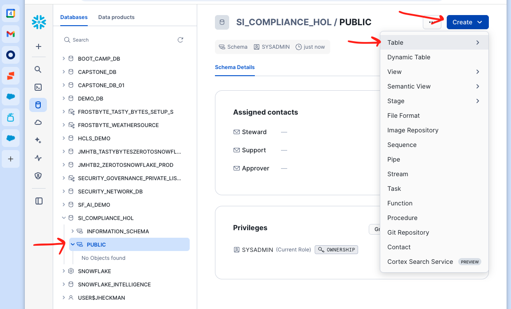

2. **Upload File**: Select the `client_organizations.csv` file from the data folder.

3. **Name the Table**: Name the table `CLIENT_ORGANIZATIONS`:

   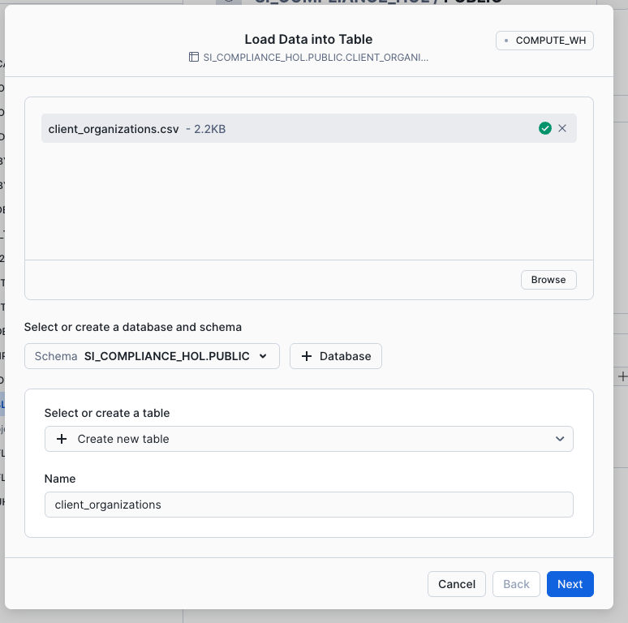

4. **Configure File Format**: Open the View Options section in the file format area and make sure that the header is the first line of the document:

   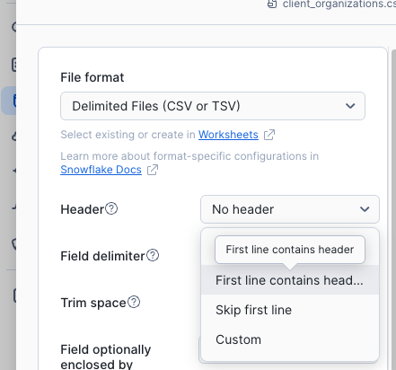

   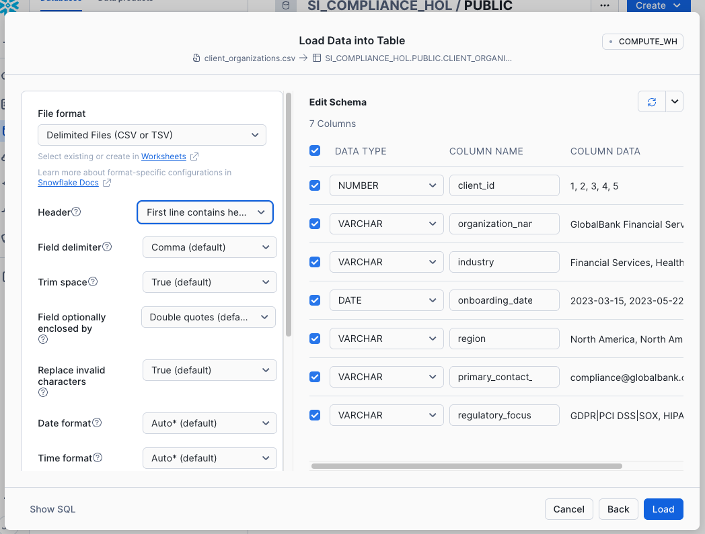

5. **Create the Table**: Click "Create Table" to complete the process.

### Loading Audit Events Table

6. **Repeat the Process**: Follow the same steps (1-5) above for the `audit_events.csv` file, naming the table `AUDIT_EVENTS`.

### Validate Your Data

Once both tables are created, open a new worksheet 

   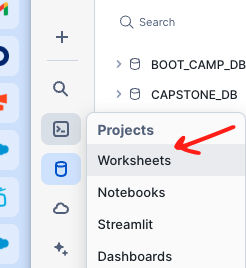

   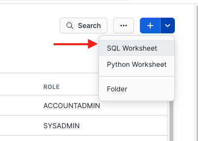

   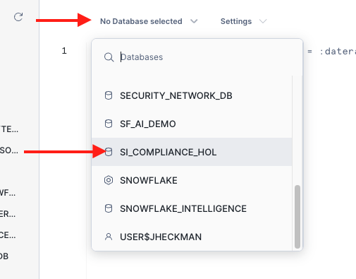

and run these validation queries:

**Validate Client Organizations:**
```sql
-- Check table structure and sample data
SELECT * FROM SI_COMPLIANCE_HOL.PUBLIC.CLIENT_ORGANIZATIONS LIMIT 5;

-- Count total organizations by region
SELECT REGION, COUNT(*) as CLIENT_COUNT 
FROM SI_COMPLIANCE_HOL.PUBLIC.CLIENT_ORGANIZATIONS 
GROUP BY REGION 
ORDER BY CLIENT_COUNT DESC;
```

**Validate Audit Events:**
```sql
-- Check table structure and sample data
SELECT * FROM SI_COMPLIANCE_HOL.PUBLIC.AUDIT_EVENTS LIMIT 5;

-- Count audits by status
SELECT STATUS, COUNT(*) as AUDIT_COUNT 
FROM SI_COMPLIANCE_HOL.PUBLIC.AUDIT_EVENTS 
GROUP BY STATUS 
ORDER BY AUDIT_COUNT DESC;
```

**Verify Relationship Between Tables:**
```sql
-- Join tables to see client organizations with their scheduled audits
SELECT 
    co.ORGANIZATION_NAME,
    co.INDUSTRY,
    ae.AUDIT_NAME,
    ae.AUDIT_TYPE,
    ae.SCHEDULED_DATE
FROM SI_COMPLIANCE_HOL.PUBLIC.CLIENT_ORGANIZATIONS co
JOIN SI_COMPLIANCE_HOL.PUBLIC.AUDIT_EVENTS ae 
    ON co.CLIENT_ID = ae.CLIENT_ID
WHERE ae.STATUS = 'Scheduled'
ORDER BY ae.SCHEDULED_DATE
LIMIT 10;
```

You should see data returned from all these queries, confirming your structured data is properly loaded.

## Step 1b: Load Semi-Structured Data (JSON)

Now we'll load the semi-structured data which contains security incident reports in JSON format. This demonstrates how Snowflake handles complex, nested data structures that vary in attributes.

### Loading Security Incidents Table

You will follow exactly the same steps as we did to load the structured data.

1. **Navigate to Tables**: Go back to the `SI_COMPLIANCE_HOL` database, Public schema, and click on tables. Click the "Create" button to create a table from a file.

2. **Upload File**: Select the `security_incidents.json` file from the data folder.

3. **Name the Table**: Name the table `SECURITY_INCIDENTS`.

4. **Configure File Format**: For JSON files, Snowflake will automatically detect the structure. You may see options for JSON parsing - accept the defaults which will create a VARIANT column to store the JSON data.

  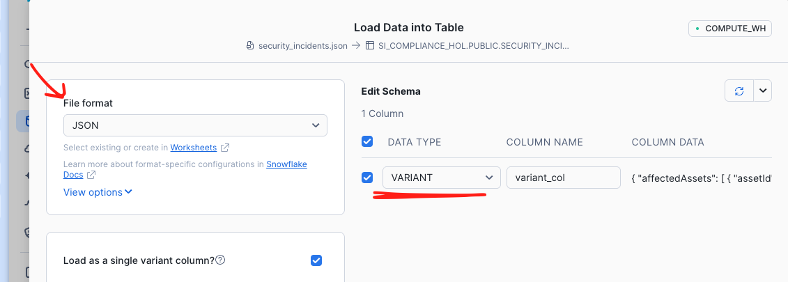

5. **Create the Table**: Click "Create Table" to complete the process.

### Validate and Parse JSON Data

Once the table is created, go back to the same worksheet where we ran the previous queries and run these queries to understand how to work with JSON data in Snowflake:

**Basic JSON Structure:**
```sql
-- View raw JSON structure
SELECT * FROM SI_COMPLIANCE_HOL.PUBLIC.SECURITY_INCIDENTS LIMIT 3;
```

**Parse Top-Level JSON Fields:**
```sql
-- Extract key fields from JSON into columns
SELECT 
    $1:incidentId::STRING as INCIDENT_ID,
    $1:incidentType::STRING as INCIDENT_TYPE,
    $1:status::STRING as STATUS,
    $1:clientId::NUMBER as CLIENT_ID,
    $1:detectionTime::TIMESTAMP as DETECTION_TIME,
    $1:resolutionTime::TIMESTAMP as RESOLUTION_TIME
FROM SI_COMPLIANCE_HOL.PUBLIC.SECURITY_INCIDENTS
LIMIT 10;
```

**Access Nested Objects:**
```sql
-- Extract risk assessment details from nested JSON object
SELECT 
    $1:incidentId::STRING as INCIDENT_ID,
    $1:incidentType::STRING as INCIDENT_TYPE,
    $1:riskAssessment.impact::STRING as RISK_IMPACT,
    $1:riskAssessment.likelihood::STRING as RISK_LIKELIHOOD,
    $1:riskAssessment.score::NUMBER as RISK_SCORE
FROM SI_COMPLIANCE_HOL.PUBLIC.SECURITY_INCIDENTS
ORDER BY $1:riskAssessment.score::NUMBER DESC
LIMIT 10;
```

**Flatten JSON Arrays:**
```sql
-- Flatten the affectedAssets array to see individual assets
SELECT 
    si.$1:incidentId::STRING as INCIDENT_ID,
    si.$1:incidentType::STRING as INCIDENT_TYPE,
    asset.value:assetId::STRING as ASSET_ID,
    asset.value:assetType::STRING as ASSET_TYPE,
    asset.value:assetOwner::STRING as ASSET_OWNER
FROM SI_COMPLIANCE_HOL.PUBLIC.SECURITY_INCIDENTS si,
LATERAL FLATTEN(input => $1:affectedAssets) as asset
LIMIT 15;
```

**Analyze Compliance Impact Arrays:**
```sql
-- Flatten compliance impact arrays to see regulatory implications
SELECT 
    si.$1:incidentId::STRING as INCIDENT_ID,
    si.$1:incidentType::STRING as INCIDENT_TYPE,
    compliance.value::STRING as COMPLIANCE_STANDARD
FROM SI_COMPLIANCE_HOL.PUBLIC.SECURITY_INCIDENTS,
LATERAL FLATTEN(input => $1:complianceImpact) as compliance
WHERE si.$1:status::STRING != 'Closed'
ORDER BY si.$1:incidentId::STRING;
```

These queries demonstrate Snowflake's powerful JSON parsing capabilities, allowing you to treat semi-structured data as if it were relational while preserving the flexibility of the original JSON structure.

## Create Structured View for Semantic Modeling

To enable semantic modeling on our JSON data, we need to create a structured view that extracts the key fields into columns. Run this query to create a view that Cortex Analyst can understand:

```sql
-- Create a structured view from JSON data for semantic modeling
CREATE OR REPLACE VIEW SI_COMPLIANCE_HOL.PUBLIC.SECURITY_INCIDENTS_VIEW AS
SELECT 
    -- Extract primary incident fields
    $1:incidentId::STRING as INCIDENT_ID,
    $1:incidentType::STRING as INCIDENT_TYPE,
    $1:status::STRING as STATUS,
    $1:clientId::NUMBER as CLIENT_ID,
    $1:detectionTime::TIMESTAMP as DETECTION_TIME,
    $1:resolutionTime::TIMESTAMP as RESOLUTION_TIME,
    
    -- Extract risk assessment details
    $1:riskAssessment.impact::STRING as RISK_IMPACT,
    $1:riskAssessment.likelihood::STRING as RISK_LIKELIHOOD,
    $1:riskAssessment.score::NUMBER as RISK_SCORE,
    
    -- Extract affected systems count and primary asset type
    ARRAY_SIZE($1:affectedAssets) as AFFECTED_ASSETS_COUNT,
    $1:affectedAssets[0].assetType::STRING as PRIMARY_ASSET_TYPE,
    
    -- Extract compliance impact
    ARRAY_TO_STRING($1:complianceImpact, ', ') as COMPLIANCE_STANDARDS_IMPACTED,
    
    -- Calculate incident duration (if resolved)
    CASE 
        WHEN $1:resolutionTime::TIMESTAMP IS NOT NULL 
        THEN DATEDIFF('hour', $1:detectionTime::TIMESTAMP, $1:resolutionTime::TIMESTAMP)
        ELSE NULL
    END as INCIDENT_DURATION_HOURS,
    
    -- Risk category based on score
    CASE 
        WHEN $1:riskAssessment.score::NUMBER >= 8 THEN 'Critical'
        WHEN $1:riskAssessment.score::NUMBER >= 6 THEN 'High'
        WHEN $1:riskAssessment.score::NUMBER >= 4 THEN 'Medium'
        ELSE 'Low'
    END as RISK_CATEGORY

FROM SI_COMPLIANCE_HOL.PUBLIC.SECURITY_INCIDENTS;
```

This structured view will be used in Step 3 when creating our semantic model, allowing Cortex Analyst to understand the relationships and enable natural language querying of security incident data.

---

**Next Step:** [Step 2: External Data Integration via Snowflake Data Sharing](step-02.md)

[← Back to Index](../README.md) | [Next: Step 2 →](step-02.md)
